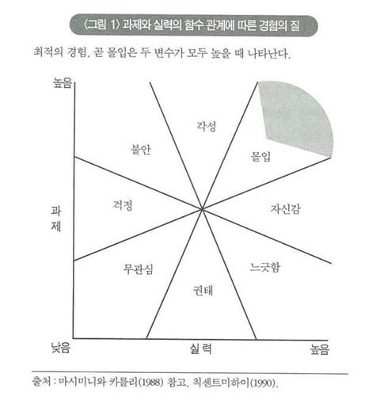

# 몰입의 즐거움

> 인간에게 좋은 것은, 비록 처음에는 약간의 저항을 극복해야 하더라도, 역시 즐거운 것이 아닐 수 없다.

노는것만 밝히는 인생보다는 가치 있다고 느낄만한 일을 하는 사람들이 많다.\
그렇게 열정을 가지고 적극적으로 삶게 뛰어드는 사람을 '자기 목적성이 충만해있다' 라고 표현한다.

그 일 자체가 좋아서 할 때, 그 일을 경험하는 것 자체가 목적이 될 때를  우리는 자기목적적이라 한다.
자기 목적성이 강한 사람은 자주 몰입 상황을 겪고, 경험의 질이 높다.

대부분의 사람들을 이러한 삶을 살길 원한다. 자기목적성을 관통하는 키워드는 몰입이다. 칙센트미하이가 말하는 몰입이란 무엇일까?

'몰입'은 삶이 고조되는 순간에 물 흐르듯 행동이 자연스럽게 이루어지는 느낌을 표현하는 말이다.

몰입은 쉽지는 않지만 그렇다고 아주 버겁지도 않은 과제를 수행할때에 나타난다.\
**적당한 난이도의 과제를 극복하는 데 한사람의 실력을 온통 쏟아부를 때 나타나는것이 '몰입' 이다.**
힘겨운 과제가 수준 높은 실력과 결합하면 일상생활에서는 맛보기 어려운 심도 있는 참여와 몰입이 이루어진다.

이러한 과제를 쉽게 부여받을 수 있는 경로는 우리가 하는 일이다.\
요즈음 세대에 가장 쉽게 몰입의 기회를 부여받을 수 있는 활동은 재미있게도 게임을 하는 것이다.\
리그 오브 레전드라는 게임이 있다. 이 게임은 자신의 실력에 맞는 사람들과 팀을 이루어 상대 팀과 대결하는데, 난이도를 승리하면 랭크 업 이라는 즉각적 보상이 주어진다. 과제의 난이도는 나의 랭크 수준에 따라 동일한 실력을 가진 상대방이 매칭됨으로 대부분의 게임 난이도는 칙센트미하이의 몰입 그래프의 '높음'에 위치하게 된다'.\
심지어 뛰어난 플레이를 하면 같은 팀원들이 이를 칭송하고 나는 뿌듯함을 느낀다. 몰입과 인정욕구를 동시에 채우는 것이다.
일과 공동생활에서 몰입을 경험할 수 있는 기회를 상실한 사람이 게임에 빠지는것은 이상한 일이 아니다.

* 게임은 달성해야 하는 명확한 목표가 있다.
* 게임은 반복으로 실력이 향상된다.
* 목표를 달성했을때 신속한 인정의 피드백을 준다.

하지만 이러한 여가활동은 여가가 끝나는 동시에 생명력을 잃는다. 게임의 주는 즐거움은 게임 속의 세계에 국한된다. 게임에서 이루었던 창조와 생산성은 게임을 끄는 순간 나에게서 단절된다. 주말을 생산적으로 보내지 못한 허무함, 피로감, 자괴감을 마주할 뿐이다. 

동기부여를 통한 목표를 달성하는 활동이 욕구에 충실하는 활동보다 그 당시에는 덜 행복할 수 있으나 전체적인 삶의 질을 더 높다.
내게 그것을 쉽게 달성할 수 있는것은 내가 하고 있는 일이다.

* 일은 달성해야 하는 명확한 목표가 있다.
* 일은 경험과 공부를 통해 실력이 향상된다.
* 목표를 달성했을때 보상을 준다.
* 조직에 기여하면 상사나 동료가 인정의 피드백을 준다.

일을 몰입을 즐기는 과제로 전환하고 그것을 도전으로 받아들인다면 나에게 만족감을 줄 수 있는 여가 활동을 애써 찾아다니는 것에 비해 합리적으로 몰입을 느낄 수 있다.  

하지만 일이란 매번 즐거움과 도전만이 가득찬 것은 아니다.

내 생업인 소프트웨어를 개발하는것을 예로 들어보자. 창의적으로 문제를 해결하는 로직을 구성하고 그것이 의도한 대로 동작하는것을 보며 큰 만족감을 느낄 수 있다.
반면 참신함이 없고 지루한 단순 반복적인 일도 존재한다. 수많은 문자열을 관리하거나(도전 의욕이 없고 지겨운 일), 아젠다가 희미한 루틴일 뿐인 회의에 참석해야 할 때(그것이 하나마나 한 일)를 예로 들 수 있다.

지겨운 일이라면 어떻게 하면 그 일을 효율적으로 처리할 수 있을지 목표를 세우라.
재밌게도 도전 의욕이 없고 지겨운 일을 도전할 가치가 있는 일로 탈바꿈 하는것은 소프트웨어 세계에서는 놀라우리만치 쉽다.
반복을 줄일 수 있도록 시스템화하고 그것을 달성하기 위해 도전하자.

하나마나한 일이라는 생각이 들 때에는 활동이 이루어지는 전체 맥락을 염두해두고 전체에 미칠 영향을 생각하며 그 속에서 의미를 찾아야 한다.\
하기 싫은 두가지일을 한번에 결합하여 시간을 단축시킬 수도 있다.  

> 인간은 사회적 동물이기 때문에 다른 사람의 목표도 배려할 줄 알아야 한다. 처리해야 할 모든 사항을 메모하고 자기가 처리할 일과 맡길 일을 구분하라.

인간은 사회적인 동물이다. 나 자신도 중요하지만 다른 사람을 배려할 줄 알아야하고 그것을 받아들이는 마음의 준비도 되어있어야 한다. 타인이 몰입의 경험을 얻을 수 있는 과제들을 빼앗지 말고 공평하게 나누자. 

짚고 넘어가야 할 점은 일은 몰입을 경험할 수 있게 해주지만 그것이 인생의 전부는 아니다.

미하이 칙센트미하이 또한 아무리 일에서 만족을 얻는다 하더라도 일이 인생의 전부가 되는 모습을 경계한다.\
일 중독자는 일에만 미쳐서 다른 목표나 책임은 안중에 없는 사람에게 어울리는 표현이다.\
이런 사람은 직무와 관련 있는 도전에만 응하고 일에 관계된 경험만을 추구하는 편협성에 빠질 위험이 있다.
삶을 풍요롭게 만들 수 있는 여러 경험을 제 발로 차지말자.

몰입할 수 있는 여가활동으로 삶의 질을 고양시킬 수 있는 새로운 가능성을 찾아보자.
주변에 잠재되어 있는 가능성을 탐구하자. 출근 시간 흐르는 개울과 물새들을 관심을 가지고 관찰하자. 이 세상에는 볼만한 것, 할만한 것들이 얼마든지 널려있다.

> 다섯 살 무렵인가, 잠에서 막 깨어나 주위를 둘러보았을 때 입에서 이런 말이 저절로 세어나왔다. "야, 참 근사한 세상이다. 이 세상은 어떻게 돌아가는 거지? 난 여기서 무슨 일을 해야하는 거지?" 
> 난 평생 그런 질문을 던지면서 살아왔다. 난 그럴 때가 좋다. 하루 하루가 새로워진다. 매일 아침 눈을 뜨는 순간이 나에게는 창조의 새벽이었다.
> -- 라이너스 폴링
